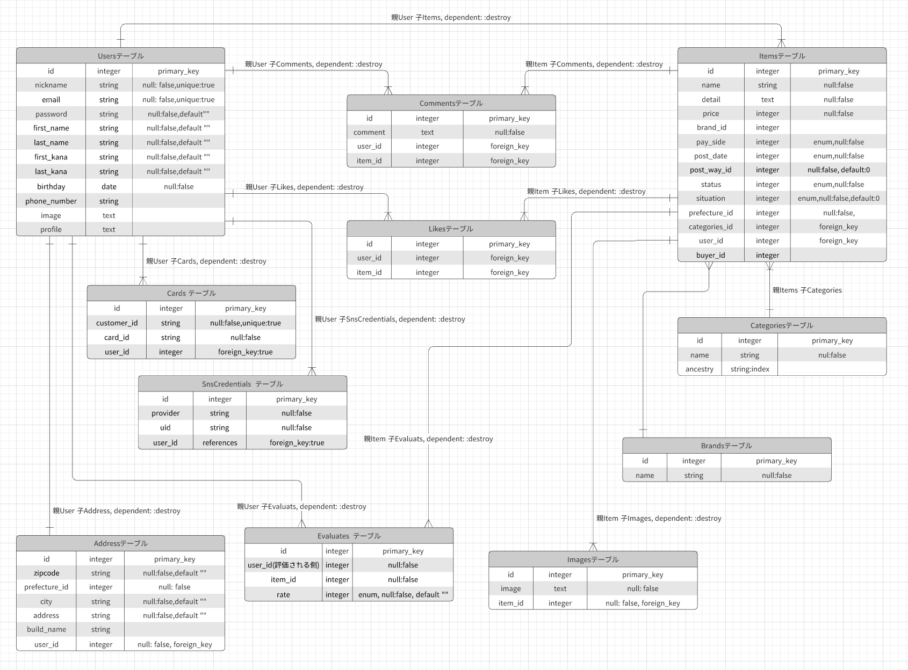

# README

## 開発内容：Development content
### フリマアプリのクローンサイトの開発
> 開発の目的
* チーム開発の経験を積むため
  - 定期的なミーティングの中で、各担当作業のアウトプットを行うこと
  - GitHub の使い方に慣れること
* 困難に立ち向かう経験をするため
  - カリキュラムの学習以外で必要な実装技術は、全て自分で調べて開発を進めること
  - 見たことがないエラーやロジックを経験し、自分で考え、チームで解決していくこと

## 開発状況：Developmental status
### 開発体制:Development system
* 人数：4名
* 開発期間：5月19日 〜 6月11日（24日間）
* スクラムを用いたアジャイル開発
* Trelloによるタスク管理
### 使用ツール:Tools used
* Slack
* Zoom
* Lucidchart
### 開発環境:Development environment
* Visual Studio Code
* Ruby
* Ruby on Rails
* Haml / SCSS / JavaScript / jQuery
* MySQL
* AWS
* GitHub
* Rspec / FactoryBot

## 開発日程：Schedule
* 開発期間：5月19日 〜 6月11日（24日間）
* 1日あたりの平均作業時間：約9時間

## データベース設計:Database Design
### ER図:Entity relationship diagram

## Users table

| Column       | Type   | Options                  |
| ------------ | ------ | ------------------------ |
| nickname     | string | null: false, unique:true |
| email        | string | null: false, unique:true |
| password     | string | null: false, default""   |
| first_name   | string | null: false, default""   |
| last_name    | string | null: false, default""   |
| first_kana   | string | null: false, default""   |
| last_kana    | string | null: false, default""   |
| birthday     | date   | null: false              |
| phone_number | string |                          |
| image        | text   |                          |
| profile      | text   |                          |

### Association

- has_one  :address, dependent: :destroy
- has_many :items, dependent: :destroy
- has_many :cards, dependent: :destroy
- has_many :comments ,dependent: :destroy
- has_many :likes, dependent: :destroy
- has_many :addresses, dependent: :destroy
- has_many :cards, dependent: :destroy
- has_many :evaluates, dependent: :destroy
- has_many :sns_credentials, dependent: :destroy

## Address table

| Column        | Type    | Options                |
| ------------- | ------- | ---------------------- |
| zipcode       | string  | null: false, default"" |
| prefecture_id | integer | null: false            |
| city          | string  | null: false, default"" |
| address       | string  | null: false, default"" |
| build_name    | string  |                        |
| user_id       | integer | foreign_key: true      |

### Association

- belongs_to :user, optional: true
- belongs_to_active_hash :prefecture

## Items table

| Column        | Type    | Options                       |
| ------------- | ------- | ----------------------------- |
| name          | string  | null: false                   |
| detail        | text    | null: false                   |
| price         | integer | null: false                   |
| pay_side      | integer | enum, null: false             |
| post_date     | integer | enum, null: false             |
| status        | integer | enum, null: false             |
| situation     | integer | enum, null: false, default: 0 |
| post_way_id   | integer | null: false, default: 0       |
| prefecture_id | integer | null: false                   |
| category_id   | integer | foreign_key: true             |
| brand_id      | integer |                               |
| user_id       | integer | foreign_key: true             |
| buyer_id      | integer |                               |

### Association

- has_many :likes,dependent: :destroy
- has_many :images, dependent: :destroy
- has_many :comments, dependent: :destroy
- has_many :evaluates, dependent: :destroy
- belongs_to :category
- belongs_to :user
- belongs_to :brand, optional: true
- belongs_to_active_hash :prefecture
- belongs_to_active_hash :post_way

## Comments table

| Column  | Type    | Options           |
| ------- | ------- | ----------------- |
| comment | text    | null: false       |
| user_id | integer | foreign_key: true |
| item_id | integer | foreign_key: true |

### Association

- belongs_to :user
- belongs_to :item

## Brands table

| Column | Type   | Options     |
| ------ | ------ | ----------- |
| name   | string | null: false |

### Association

- has_many :items

## Images table

| Column  | Type    | Options           |
| ------- | ------- | ----------------- |
| image   | text    | null: false       |
| item_id | integer | foreign_key: true |

### Association

- belongs_to :item

## Likes table

| Column  | Type    | Options           |
| ------- | ------- | ----------------- |
| user_id | integer | foreign_key: true |
| item_id | integer | foreign_key: true |

### Association

- belongs_to :item
- belongs_to :user

## Categories table

| Column   | Type         | Options     |
| -------- | ------------ | ----------- |
| name     | string       | null: false |
| ancestry | string:index |             |

### Association

- has_many :items

## Cards table

| Column      | Type    | Options                  |
| ----------- | ------- | ------------------------ |
| customer_id | string  | null: false              |
| card_id     | string  | null: false, unique:true |
| user_id     | integer | foreign_key:true         |

### Association

- belongs_to :user

## Evaluates table

| Column      | Type    | Options     |
| ----------- | ------- | ----------- |
| evaluate_id | integer | null: false |
| user_id     | integer | null: false |
| item_id     | integer | null: false |
| rate        | integer | null: false |

### Association

- belongs_to :user
- belongs_to :item

## SnsCredentials table

| Column   | Type       | Options          |
| -------- | ---------- | ---------------- |
| provider | string     | null: false      |
| uid      | string     | null: false      |
| user_id  | references | foreign_key:true |

### Association

- belongs_to :user, optional: true
